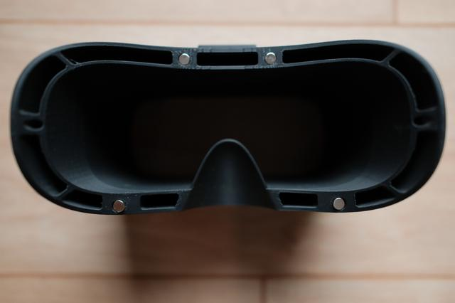
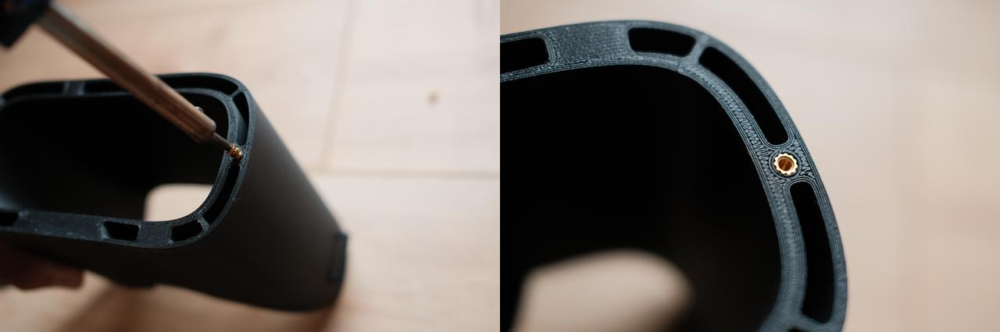
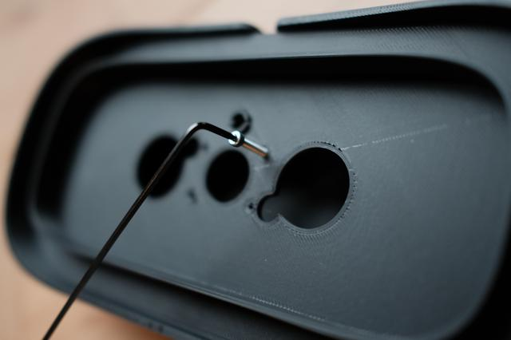
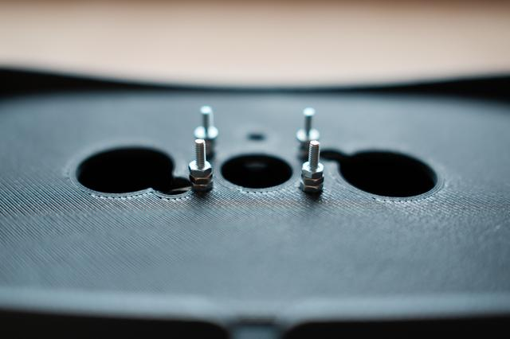
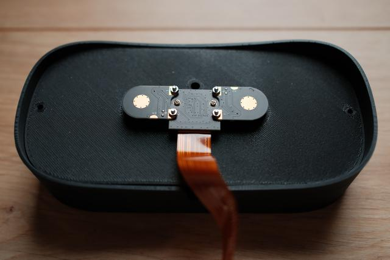
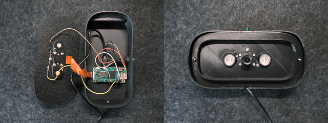
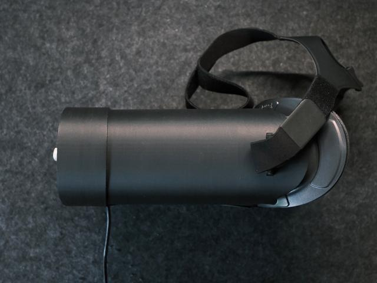

# BOM

## List of Materials
| Item | Quantity | Purpose | Link |
|------|----------|---------|------|
| HP Reverb Facial Interface | 1 | Facial Interface (Original no longer available. Replicas still available from third-party retailers. Currently searching for replacement.) | [amazon.com](https://www.amazon.com/Version-Glasses-Cushion-Headset-Replacement/dp/B0DSCFK3ZB/ref=pd_rhf_se_s_pd_sbs_rvi_d_sccl_2_4/136-9027631-8567512?pd_rd_w=Tz6IV&content-id=amzn1.sym.6640a844-ab24-4352-ac9b-78899e683a5e&pf_rd_p=6640a844-ab24-4352-ac9b-78899e683a5e&pf_rd_r=FY33D03VXM40G92631W9&pd_rd_wg=Dz4y9&pd_rd_r=76d417aa-5f5e-46be-99b1-264097a3c1a8&pd_rd_i=B0DSCFK3ZB&psc=1) |
| DJI FPV Goggles Headband | 1 (optional) | Securing the headset to a subject's head | https://store.dji.com/de/product/dji-fpv-goggles-headband |
| Raspberry Pi Zero 2W | 1 | Camera and LED control | https://www.raspberrypi.com/products/raspberry-pi-zero-2-w/ |
| RPi Camera (F) | 1 | Recordings | https://www.waveshare.com/wiki/RPi_Camera_(F) |
| Micro USB cable | 1 | Power supply and control of the Raspberry Pi (If you want to control the Raspberry Pi via a smartphone, you will also need a USB-A to USB-C adapter.) | --- |
| Button, 1-pin NO contact, illuminated, green | 1 (optional) | Can be used to start recording or as an indicator of system status | [reichelt.com](https://www.reichelt.com/us/en/shop/product/button_1-pin_no_contact_illuminated_green-44434?q=%2Fapi%2Fuser%2FcountrySelect%2Fen%2Fhttps%3A%2F%2Fwww.reichelt.com%2Fae%2Fen%2Fshop%2Fproduct%2Fbutton_1-pin_no_contact_illuminated_green-44434#closemodal) |
| Rodmagnet Ø 6.0 x 12.0 mm N35 nickel - holds 1,2 kg | 4 | Attaching the facial interface to the rest of the headset | [magnet-shop.com](https://www.magnet-shop.com/neodymium/rodmagnets/rodmagnet-6.0-x-12.0-mm-n35-nickel-holds-1.2-kg) |
| M2 screws (12 mm) | 4 | Installing the IR camera | --- |
| M2.3 screws (5 mm) | 2 | Mounting the Raspberry Pi in the lid of the case | --- |
| Hexagonal Nuts M2 | 16 | Installing the IR camera | --- |
| 3D printing, threaded inserts, M3x5.7 | 2 (Optional. Lid stays in place even without screws.) | Attaching the cover to the headset | [reichelt.com](https://www.reichelt.com/us/en/shop/product/3d_printing_threaded_inserts_m3x5_7_pack_of_100-332213#closemodal)|
| M3 screws (35 mm) | 2 (Optional. Lid stays in place even without screws.) | Attaching the cover to the headset | --- |
| 5mm LED | 1 (color and brightness depend on the use case and object of investigation)| Triggering the PLR | --- |
|Jumper wire cable (female to male) | 2 or 6 | Two for controlling the LED. Two more if the button is required | --- |

## Assembly

1. First, the rod magnets must be pressed into the holes provided in the housing. The magnets should be inserted flush into the housing. Make sure that the magnets are pointing in the right direction so that they can be connected to the facial interface, as the magnets cannot be removed once they have been inserted.

    

2. (Optional) Next, the threaded inserts are inserted into the 3D-printed plastic case. This requires a soldering iron to heat the threaded inserts and slowly melt them into the designated holes.

    

3. Attaching the IR camera: To do this, first screw the 12 mm long M2 screws into the 3D-printed camera mount.

    

    It is then recommended to attach three nuts to each of the four screws on the back. This ensures that the camera is positioned perfectly straight. It also ensures that the conductive surfaces of the camera and the IR LEDs are better aligned.

    

    Now the camera can be attached to the camera mount. Don't forget to connect the ribbon cable supplied with the IR camera beforehand.

    

4. Next, a 5 mm LED is inserted into the hole above the previously attached camera. The LED is soldered to two female to male jumper cables with its contacts. The female side of the cables is connected to the Raspberry Pi. The cathode should be connected to a ground pin, while the anode is connected to a GPIO pin, which depends on the implemented control. If you want a button to start recording, insert the button into the hole at the top of the cover. Here, as well, the female to male cables must be soldered to the button. The female side of the cables is again connected to the pins of the Raspberry Pi, depending on the desired control.

5. Before the headset can be assembled, the Raspberry Pi must be attached to the cover of the housing using the M2.3 screws. In addition, the camera's ribbon cable must be connected to the Raspberry Pi. To enable communication with the Raspberry Pi via a USB cable, a micro-USB cable must now be connected to the Raspberry Pi's data interface.

    

6. Finally, all parts of the headset can be assembled. The camera mounting part is inserted into the rear part of the main unit and then closed with the cover to which the Raspberry Pi is attached. The facial interface is then connected to the main unit using the magnets. If it is necessary to attach the headset hands-free to a person's head, the DJI FPV Goggles headband can now be attached to the designated eyelets. If the cover of the housing needs to be secured separately, it can be attached to the threaded inserts using 35 mm long M3 screws.

    